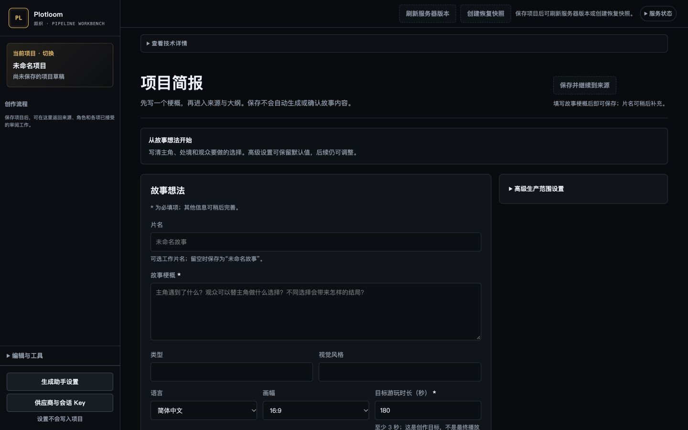
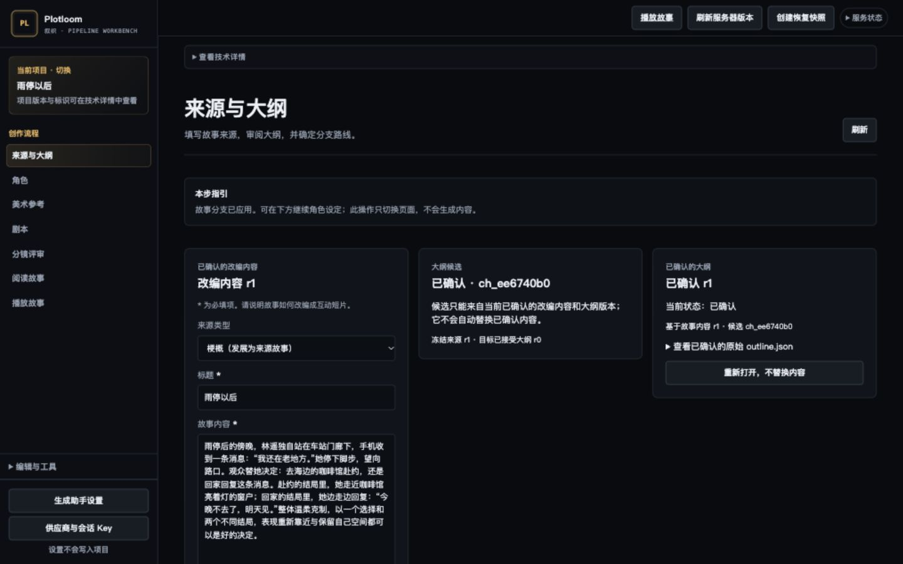
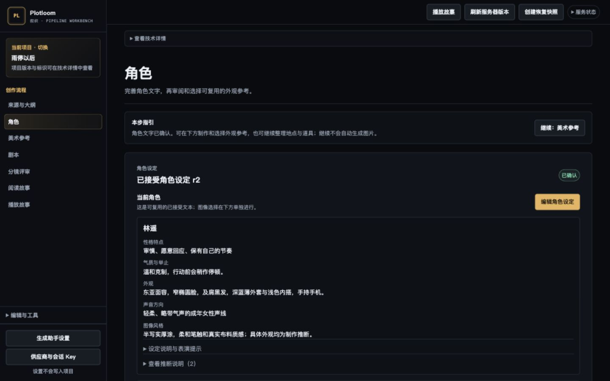

# Plotloom 创作者手册

本手册帮助你把一个故事想法做成有选择、有不同结局的互动短片。你不需要先理解内部模块：沿左侧“创作流程”完成内容审阅，再为镜头选择图片和视频片段，最后检查两条播放路线。

适用于 2026 年 10 月 4 日的中文创作流程界面。截图展示未保存的简报，以及已有项目“雨停以后”的来源和角色；不表示图中项目已经完成全部制作。界面版本、截图来源与验证范围见[验证记录](../verification/2026-10-04-creator-ui-polish.md)。

## 开始之前

打开管理员提供的工作台地址。本机安装的示例地址是 `http://127.0.0.1:8841/v2/`；如果在另一台电脑工作，请使用管理员提供的地址，不要直接照抄这个本机地址。

开始生成前，确认文字创作助手和图像生成助手已经配置。左下角“生成助手设置”可以查看它们；所需聊天 ID 应由管理员提供。聊天标题不是聊天 ID，两个助手应使用不同聊天，每个助手一次处理一项任务。保存设置不会发送任务。

视频服务需要另外启用和配置。若界面提示视频后端未启用，可以先完成剧本、分镜和图片审阅；不要把这理解成所有内容丢失，也不要擅自换供应商或反复提交。

首次练习建议只做一个观众选择和两个结局。先让流程和故事表达顺畅，再提高画面精细度。轻微镜头晃动不一定要重做；人物明显变样、关键文字读不清、对白或声音被截断，则需要处理。

## 认识界面中的几种操作

| 操作 | 它做什么 | 它不做什么 |
| --- | --- | --- |
| 保存或确认改编内容 | 将你填写的内容写入项目 | 不自动生成后续内容 |
| 准备任务或创建提案 | 固定本次任务所用的来源、版本和要求 | 不等于助手已经开始或完成生成 |
| 发送给助手 | 将已准备的任务交给指定助手 | 不自动确认返回结果 |
| 确认使用候选 | 审阅后，明确将候选作为该环节的已确认版本 | 不代表图片、声音或成片全部合格 |
| 选择参考图或审核关键帧 | 明确指定后续制作使用哪张图片及其用途 | 看图、放大或导入不会自动选择 |
| 确认用于故事 | 将已听看的当前视频片段用于这个镜头的播放 | 不改动原片，也不等于最终成片批准 |
| 继续到下一步 | 切换到下一环节 | 不自动准备、生成或确认内容 |

带 `*` 的输入是必填项。停用按钮使用较暗文字和虚线边框；先看附近的原因，再补全前置条件。“正在保存”“正在检查”等表示操作进行中，此时不要重复点击。

页面上的步骤指引（如“本步指引”或简报页的“从故事想法开始”）说明当前任务。判断进度时，优先看当前状态和指引，不要只看旧报告、历史候选或曾经确认过的版本。界面中的“已接受”也是对应环节的确认记录，不表示整部影片完成。

## 快速上手示例

以“雨停以后”为例：林遥在雨后的车站门廊收到邀约，观众决定让她赴约，或先回家。赴约结局止于咖啡馆窗外；回家结局让她回复消息并继续前行。两条选择都可以成立，不需要把其中一条写成错误答案。

1. 在项目简报写清这段梗概，保存并进入来源。
2. 确认改编内容，准备并发送大纲任务；读完候选后确认使用。
3. 在“故事分支”填写开场、两个结局和选择，保存后应用到故事路线。
4. 依次确认角色文字、美术设定、完整剧本和分镜评审。
5. 完成投产提案中的戏剧意图与呈现归属审阅，再确认投产。
6. 为镜头批准当前分镜，选择人物参考，制作并审核关键帧。
7. 视频服务就绪时，为镜头制作原片；从原片准备待审片段，听看后确认用于故事。
8. 先阅读两条路线，再播放两条路线，分别检查结局和声音。

下面按这个顺序说明每一步。你可以返回前面修改，但上游变化可能使下游结果过期，需要重新核对。

## 项目简报

在首页点击“创建空白项目”；如果已经打开项目，从左上角“当前项目 · 切换”进入项目目录，选择“新建空白项目”。“打开示例项目”用于了解界面，不是助手已经为你完成的新作品。

填写“故事梗概”和有效的“目标游玩时长（秒）”。时长至少为 3 秒，填写整数；它是创作目标，不是实际生成时长的保证。片名可选，留空会保存为“未命名故事”。类型、视觉风格和高级设置可以稍后补充。

点击“保存并继续到来源”。这会创建项目并把片名、梗概作为可编辑的来源草稿，不会接受大纲或启动生成。已有项目显示“保存修改”，保存后留在简报页，不覆盖已经确认的来源。

“其他工作流：旧版故事提案”是独立的旧版入口。第一次按本手册操作时，使用上方的保存入口；不要把旧版提案生成和来源审阅流程混在一起。

高级设置中的“每场分镜”是镜头数量偏好。“创作建议（超出时提示）”与“严格限制（超出时阻止确认）”有不同含义，不能因为想继续而随意更改已有项目的规则。

完成检查：左上角显示已保存的项目名称，当前页进入“来源与大纲”。

## 来源与大纲

先确定这次改编的内容，而不是直接要求模型写完整影片。

1. 选择来源类型，填写“标题”“故事内容”和“改编意图”。例如，说明保留一个选择、两个结局，使用动作和少量对白推进。
2. 如允许添加原文以外的内容，可填写“允许的原创补充（可选）”；不需要补充时可以留空。
3. 点击“确认改编内容”。这一步只保存来源。
4. 点击“准备大纲任务”，再点击“发送给文字创作助手”。
5. 等待返回，必要时使用“检查任务结果”。阅读候选大纲，确认故事含义、人物动机和结局方向后，点击“确认使用此大纲”。

候选报告是阅读和检查的材料。打开报告、展开原始数据或看到报告中的检查通过，不等于你已确认候选。

完成检查：“已确认的大纲”显示当前版本，下面可以编辑“故事分支”。若修改了来源，先处理大纲和分支的过期提示，再继续后续环节。

## 故事分支

当前来源流程支持一个观众选择、两个结局。它们是两条完整路线，不是同一结局的两个标题。

填写开场和两个结局的“章节标题”“章节摘要”，再填写“选择问题”、两条“选项文字”及“选择后的发展”。核对每条路径指向正确的“对应结局”。稳定章节 ID、选择 ID 和路径 ID 用于保持内容对应；默认值通常无需修改，保存后有些 ID 不再允许编辑。

“雨停以后”可以这样安排：

| 位置 | 内容 |
| --- | --- |
| 开场 | 林遥在门廊收到消息，停下来望向路口 |
| 选择问题 | 林遥要如何回应这条消息？ |
| 路径一 | 去咖啡馆赴约，走到亮着灯的窗外 |
| 路径二 | 今晚先回家，回复消息后继续前行 |

先点击“保存修改”，再点击“应用到故事路线”。仅保存表单还不能继续使用新的路线。已应用且没有修改时，这两个按钮会停用，附近说明无需再次操作。

完成检查：看到“故事路线已就绪”和两条路线摘要，点击“继续：角色设定”。如果来源或分支仍有未保存修改，先处理草稿，不要试图绕过提示。

## 角色文字与外观参考

角色文字确定人物的性格、外观和表演方向；身份参考图帮助后续镜头维持同一人物。它们需要分别确认。

1. 在“角色”页点击“创建新角色提案”，准备后发送给文字创作助手。
2. 返回后阅读角色文字，核对哪些描述来自故事，哪些属于制作推断；修改不合适的内容，再点击“接受这份角色设定”。
3. 在下方“外观参考”选择角色。可以导入已有图片，或在“用文字探索下一张图片”输入想法，选择“全新生成”或“基于图片修改”，然后“创建提案”。
4. 提案准备后，还需要明确“发送给图像生成助手”。返回的图片加入候选，比较后再选用身份参考。

“当前查看”只是正在看的图片；“当前已选用”才表示已经选为身份参考。导入为外观选项、放大图片、创建或发送提案，都不会自动改变身份参考。

角色文字已确认后，可以先“继续：美术参考”。但真正为有人物的镜头准备图片任务前，必须补齐该人物当前可用的身份参考。

完成检查：文字显示当前已确认状态；需要人物图片的镜头对应角色已有明确选择的参考。以后修改角色设定或参考图，须核对受影响的下游任务。

## 美术设定与环境道具参考

先确认地点和道具是什么，再按需制作参考图。选择美术风格后，点击“准备美术设定任务”，发送给文字创作助手。返回后阅读美术设定，点击“确认使用此美术提案”。这一步不会生成图片。

已确认的设定下方有“环境 / 道具参考图片”。选择主体，填写本次图片要求，准备并发送图片任务；返回后比较候选，再明确用作该环境或道具的参考。需要另一张图时，使用“修改要求，再生成一张”，不会把原来交付的要求改写成新要求。

环境和道具参考目前仅用于对应参考审阅，界面明确提示它们尚未被镜头或生产流程自动消费。选好了参考图，也不能假定后续镜头已经用到它。

美术报告是交付时的原始快照。报告写“尚未出图”时，外侧工作台可能已有后来生成的图片；如果编辑过 `art.json`，以当前已确认内容为准，不以旧报告替代当前状态。

完成检查：地点与道具设定显示已确认，按需完成参考图片审阅，点击“继续：剧本”。若保留了未保存草稿，先明确保存、舍弃或采用当前版本。

## 完整剧本与章节修改

点击“准备剧本任务”，发送给文字创作助手，返回后阅读开场和两个结局。“确认使用此剧本”确认的是完整剧本，不只当前屏幕显示的章节。

先检查两个结局是否都能从开场自然到达：选择问题明确，对应动作不同，结果都能看懂；人物、地点和道具沿用已确认设定。

需要修改已确认剧本时，点击“重新打开剧本”，选择章节。当前章节编辑使用结构化 JSON；修改内容时保留章节和实体 ID，不熟悉格式时请项目负责人协助。点击“保存此章节，不覆盖其他章节”，只保存所选章节。

如果编辑期间服务器版本变化，界面会保留原草稿并停用保存。先比较文字，再选择“舍弃章节草稿”或“用当前章节替换草稿”；不会自动把旧草稿套到新版本。

完成检查：剧本显示当前已确认状态，没有待处理的编辑或过期提示。点击“继续：分镜评审”。此时也可以“阅读故事”，先检查文字路线。

## 分镜评审

点击“准备分镜任务”，发送给文字创作助手。阅读返回的镜头方案：动作是否可见，景别和镜头运动是否表达剧情，两个结局是否都覆盖完整。符合要求后点击“确认此分镜评审方案”。

“评审镜头上限（秒）”用于这次拆分评审，不等于视频服务保证能够生成该时长。投产时还需要满足镜头时长、帧数和实际后端能力。

确认分镜评审不会自动投产或生成媒体。继续在本页完成“投产提案”。

## 投产提案

点击“准备投产提案”，把已确认内容整理为后续制作使用的场景和镜头。此时仍有两类内容需要你审阅。

1. “戏剧意图整包审阅”：逐项说明场次目标和节拍目的。可以填写，或在已配置的文本服务可用时使用“生成戏剧意图建议”；模型建议仍需审核。完成后“保存戏剧意图整包”。
2. “实体画面、可见文字与选择界面：整包归属审阅”：明确每段内容由实际动作、画面内文字、播放器选择界面、台词或仅评审说明承担。混在一起的内容先拆分，再保存呈现归属整包。
3. 解决界面列出的冲突，保存修改，再点击“确认投产提案”。它会建立后续制作使用的场景与镜头数据，不会自动生成图片或视频。

把观众选项归为“播放器选择界面”，不要让模型在场景内重复画一组选择按钮。需要在画面出现的消息，必须保持准确文字来源；它与台词和评审说明不是一回事。

完成检查：显示“投产提案已确认”，当前镜头仍有效时出现“继续：打开第一个镜头”。也可以展开“查看场次与镜头”打开其他镜头。

## 镜头批准和关键帧

进入镜头后，先看“当前镜头准备状态”。使用“前往分镜审核”，检查当前分镜并填写实际审核人，再“批准当前分镜”。内容或版本变化后，历史批准不能代替新的当前批准。

展开“准备与参考 · 图片、角色、导入”。核对本镜头出现人物的参考图，在“镜头图片”中填写画面呈现要求，点击“准备原始图片任务”，再“发送给图像生成助手”。等待返回，可用“立即检查交付”。“交付检查通过”只表示交付符合检查要求，不代表你选用了图片。

展开“关键帧与静帧预览”，比较候选后保留要审阅的图片，再完成以下操作：

1. 身份、构图或风格意图至少填写一项，并记录至少一项“来源引用（每行一项）”。说明这张图与已批准镜头的关系，不要把新剧情加入图片要求。
2. 点击“保存意图”，已有意图时使用“细化意图”。
3. 填写“审核兼容性说明”，点击“审核为当前镜头关键帧”。
4. 有人物身份参考的候选，还需要“跨镜头同一人物视觉复核”。比较任务冻结的主参考、补充参考和候选，填写身份对比、镜头状态和复核备注，再“记录视觉复核”。

填写真实审阅者。由 Codex 完成的检查写为 Codex，不能登记成真人确认。复核不是人脸识别，也不能代替对服装、动作、道具和镜头状态的检查。

连续镜头的当前关键帧和必要复核都齐全后，可“创建连续静帧预览”。这是图片按顺序的预览，不是已经生成的视频，也不是成片接受。

## 视频原片和故事片段

视频服务启用后，依次完成“原片 → 播放片段 → 用于故事”。如果当前界面提示后端未启用或没有合格配置，先联系管理员；本手册不要求你开启付费服务或修改供应商配置。

在“准备或生成新的 MiniMax H3 原片”中，按当前控件选择“H3 质量用途（必选）”“H3 输出尺寸（必选）”“H3 时长（已审核）”和随机种子。读取来源后，填写并审阅英文制作说明；也可先请助手起草，但仍须核对。点击“预览完整 H3 提示词”，确认后点击“冻结此说明并准备原片”。这只准备任务，之后再按界面状态点击“提交一次”。不需要把中文故事正文改成英文。

提交后，任务显示“获取结果”按钮时，可用它检查已知提交的结果。若状态显示 `outcome_unknown`（结果不确定），不要重新提交同一任务，也不要用换页面、重启或取消来假定服务没有收到请求；保留任务记录并联系管理员检查。这个状态没有“获取结果”按钮，不要另建任务绕过它。

原片回来后，不要立即按原片长度加入故事：

1. 核对“原稿镜头时长”“后端请求时长”和“实测原片”，它们可能不同。
2. 设置“片段入点（帧）”，点击“生成待审片段”。系统按原稿时长保留连续画面和同期声音，原片不变。
3. 播放待审片段，检查动作、对白、文字和首尾声音。尤其要实际听，不用技术检查通过代替听觉审阅。
4. 满意后点击“确认用于故事”。需要的声音审阅仍由实际听过的同事完成；没有听过，就明确保留为待审，不写成已通过。

已拒绝原片需要填写审核人与理由，再“重新开放审阅”，才能重新考虑。重新开放不会自动准备片段、选择播放或生成新视频，旧拒绝记录仍保留。

完成检查：当前镜头有当前有效、已选择的播放片段，时长与原稿相符。对开场和两个结局的所有镜头重复此步骤。

## 小字难以呈现时

首先考虑写法：减少不承担剧情的小字，缩短必须看懂的信息，避免要求模型在倾斜、移动的手机屏幕上塞满句子。剧情依赖的文字不能直接删掉；修改来源或表达方式后，要重新审阅相关内容。

需要保留准确消息时，可以在“镜头呈现调整”选择弹出消息的方式。当前提供未发送草稿和独立发送动作两种呈现；从本镜头或紧邻前镜头的准确文字来源中选择，填写调整理由，核对确认后保存。

未发送草稿不能表现为已经发送；发送镜头需要清楚的发送动作和已发送状态。调整后，重新审核受影响镜头的关键帧。此操作不改写原始剧本，也不自动让其他镜头采用相同调整。

“弹出预览”是一种交给生成模型实现的画面要求，不是已经提供的自动字幕或文字后期服务。仍须检查结果中每个字和状态是否正确。它可以降低小屏幕斜角文字的难度，但不保证一次生成成功。

## 阅读和播放两条路线

左侧“阅读故事”和“播放故事”会在新标签页打开，原来的编辑页保持不变。

“阅读故事”用于审阅当前已确认剧本，可以切换路线；有当前分镜评审时还可以切换到“分镜”。“分镜 · 正在检查”与“当前不可读”不同，前者仍在读取，后者需要处理缺失、过期或读取问题。使用“返回创作流程”回到对应编辑环节。

“播放故事”使用当前选定的播放片段。先完整走赴约路线，再“从头开始”选择回家路线，分别核对选择时机、镜头顺序、结局和声音。不要只播放公共开场就判断两个结局都完成。

如果提示缺少某个镜头的播放媒体，回到该镜头检查当前片段和选择状态。旧的选择、仅有原片或已经过期的片段，都不能证明当前路线可播放。

第一次流程验收可以采用“表达清楚、画面和声音可接受”的标准，不要求每一帧达到最终制作质量。成片质量提升和创作者最终批准是之后的独立审阅。

## 修改和安全恢复

上游内容决定下游任务使用的版本。改来源、角色、剧本、分镜、身份参考或呈现方式后，受影响结果可能显示“上下文已过期”“需更新”或“历史”。它们仍可查看，但不能直接当作当前可用结果。

| 遇到的情况 | 先做什么 |
| --- | --- |
| 停用按钮 | 阅读旁边原因，补齐当前前置条件；不通过刷新强行跳过 |
| 正在读取或正在刷新 | 等待读取完成；未知状态不代表缺失，也不代表可继续 |
| 读取失败 | 使用本页的重试或重新读取；保留内容不代表版本已核实 |
| 任务已准备但未发送 | 核对任务后明确发送；准备不等于生成 |
| 助手忙碌、已入队或发送结果不确定 | 保留任务记录，检查现有任务；不要重复发送 |
| 候选与旧已确认版本同时存在 | 按当前任务指引处理新候选，旧版本不代表新任务完成 |
| 未保存草稿与服务器新版本冲突 | 先比较或复制所需文字，再明确舍弃或采用当前版本，不强制覆盖 |
| 归档项目只读 | 在项目目录恢复后继续；恢复草稿不能解除项目只读 |
| 视频已返回但不能用于故事 | 核对当前性、原稿时长、帧数与片段审阅，不拉长短原片或绕过锁定 |

切换阶段或项目时，如果出现草稿提示，按用途选择保存、丢弃或取消。恢复草稿只恢复编辑内容，不自动确认来源、接受候选或批准分镜。重要内容可以先复制到自己的笔记，再做明确舍弃。

“创建恢复快照”用于已有项目的恢复；它不代表媒体已审阅。复制项目文件夹前先使用项目目录中的“关闭项目”，等服务确认关闭后再复制；不要在后台任务仍占用项目时直接复制运行中的目录。

“永久删除”不是一般的返回或重做方法。它会删除指定证据或项目，应核对目标和影响；日常迭代优先保留历史，不需要为了重新生成而清空旧结果。

## 术语速查

| 术语 | 在这里的含义 |
| --- | --- |
| 候选 | 返回但尚待创作者审阅的内容或媒体 |
| 当前版本 | 与现有来源、批准和相关参考仍相符的版本 |
| 冻结 | 为某次任务固定输入；后续改动不会悄悄改写该任务 |
| 身份参考 | 跨镜头保持同一人物外观的已选择图片 |
| 关键帧 | 已审核用于该镜头的图片，视频制作仍是下一步 |
| 原片 | 视频服务返回的完整素材，保持原样保留 |
| 播放片段 | 从原片按原稿时长准备、听看并明确选用的连续画面与同期声音 |
| 过期或历史 | 仍有记录，但不一定适用于当前内容 |
| Profile | 供应商配置；一般由管理员维护 |
| 会话 Key | 当前浏览器标签页使用的临时密钥，不写入项目内容；不要粘贴到故事或任务说明 |

## 交给同事前的检查清单

- [ ] 来源、大纲、分支、角色、美术设定、剧本、分镜评审都处于当前已确认状态。
- [ ] 一个观众选择对应两个完整结局，选项与剧情后果一致。
- [ ] 投产提案已确认，没有未保存的戏剧意图或呈现归属修改。
- [ ] 需要人物参考的镜头已有当前身份参考，关键帧及人物复核齐全。
- [ ] 每个必需镜头有当前已选播放片段，原稿时长与片段相符。
- [ ] 两条路线均完整播放过，关键文字、动作与首尾声音已检查。
- [ ] 声音由实际听过的人审阅，未审项目明确保留为待审。
- [ ] 没有把报告检查通过、模型返回或代理判断写成创作者最终批准。
- [ ] 交接时说明已知限制、待改进画面，以及是否仅通过首轮流程验收。

手册指导操作，不代替团队的创作判断。熟悉流程后，主要依赖界面的当前状态和本步指引；遇到没有明确恢复路径的问题，保留原任务和证据交给项目负责人，不用重复生成来试探。
