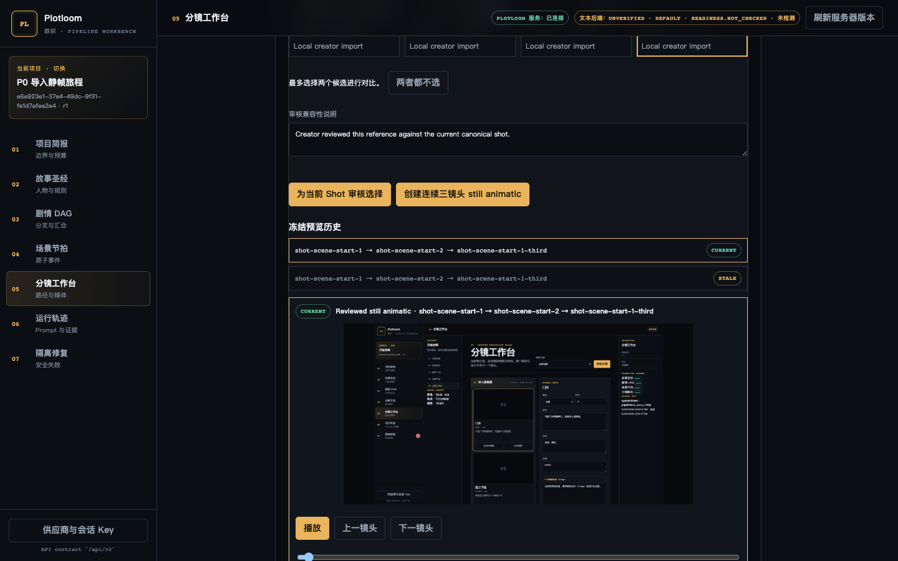

# P0 imported still preview verification

- Candidate commit: local `codex/p0-imported-still-preview` worktree from `afb5583da56311337717b6569e21b33befbba4ab`.
- Browser exercised at 1440×900 against a fresh local SQLite database and filesystem artifact store on 2026-09-11.
- Imported four repository-owned PNG files through the multipart UI, compared candidates, and selected reviewed keyframes for the first three contiguous shots in one scene.
- The non-generative still animatic played, paused, and sought between reviewed stills.  Reload and a real process restart both restored the frozen preview.
- Replacing the first reviewed keyframe changed the existing preview to `STALE`; creating a new preview produced a separate `CURRENT` history item while retaining the stale frozen manifest.
- No image/video provider was configured or called.  The existing provider hard-stop remains visible in the same workbench.

