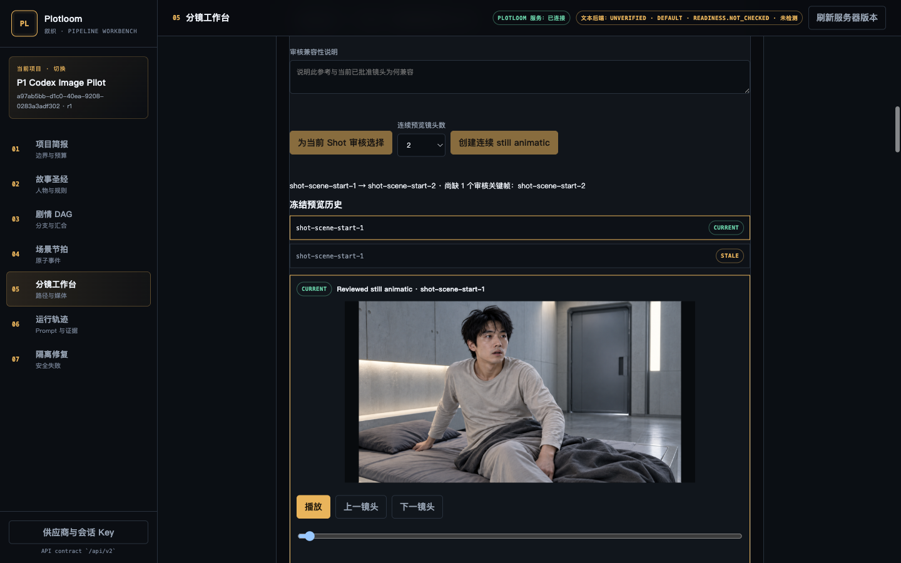

# P1 Codex image jobs — bounded verification receipt

Date: 2026-09-11
Scope: approved P1 manual Codex image-job path only; no automatic bridge, external
image API, provider credential, or production release is claimed.

## Contract and implementation

[ADR 0028](../adr/0028-agent-operated-image-jobs.md) assigns canonical facts,
Approval, frozen single-shot `ProductionUnit`/Snapshot, hashes, reference bytes
and candidate publication to trusted Plotloom code. The browser can submit only
canonical identifiers. The specialist receives a same-host package projected from
database-frozen inputs, uses the built-in image tool, then supplies untrusted
JPEG/PNG bytes plus a versioned completion manifest. Because the local specialist
can read that package, Refresh reconstructs and verifies its entire request,
instruction, and reference-byte projection before it reads or publishes a
delivery. It confines paths, rejects symlinks and undeclared/partial/tampered
data, decodes bounded rasters, and atomically records accepted candidates or
inapplicable historical late returns.

The P1 records are migration `0015_agent_operated_image_jobs`; the exchange root
is runtime-only `PLOTLOOM_IMAGE_EXCHANGE_ROOT`. It is not canonical state or a
browser-provided path, and packages/manifests carry no provider credentials.

## Real isolated browser journey

An isolated local FastAPI process used file SQLite and a dedicated temporary
exchange/artifact root. The browser prepared and copied an original job, then
refreshed a specialist delivery. The selected original was used as the frozen
parent reference for a second copied job. A Codex specialist task invoked the
built-in image-generation tool for both calls; it wrote only the corresponding
delivery inboxes and manifests.

| Step | Job / result | Bound evidence |
|---|---|---|
| Original | `ij_adc2485b93f145feba604ceaf5aec196` | request `29863243f99ff97fee38fd6d29f0c870b7b262fb79b9fcc89fc6ed84befc527a`; candidate output `9ba11d7c93da006964aec26bdb55ec7a723a371c5ac898a938742faecc2a9fd8` |
| Refinement | `ij_5711886420514073a28f2f7b0fd7a4e5` | request `98977af1e6b51080a8eeffeddc075fff5e827f0d0da6c6eb236ecc96e54c2874`; candidate output `3a8c837cf32e41b3388e46a48234d9c2702656a6211e5b5c35213ac6cdfecd54` |
| Explicit review | refinement selected | P0 reviewed-keyframe selection created a new current one-frame still preview; the old preview is explicitly stale |
| Restart | same SQLite and artifact root reopened | both jobs remained delivered, the refinement candidate remained current, and the new preview reopened after server stop/start |

The browser evidence is the post-restart screenshot:

## Automated evidence

Focused backend coverage verifies original/refinement packages, required parent
reference bytes, a package edited both before and after Copy, P0 selection,
partial/tampered/conflicting manifests, cross-project/forged authority, rejected
browser-supplied paths, symlink escape, malformed/oversized files,
cancellation/revocation late delivery, archive admission and concurrent
delivery-id reconciliation. The final full-gate results are recorded at delivery.

Final stable-candidate gates:

- `uv run --locked pytest -q`: `540 passed, 9 skipped` (the existing suite's
  272 warnings are Starlette/SQLite/Pydantic deprecations, not P1 failures).
- `npm --prefix frontend test`: `120 passed`; `npm --prefix frontend run
  typecheck`: passed.
- `npm --prefix frontend run build`: passed; the checked-in static bundle was
  regenerated and confirmed fresh. Vite retains its pre-existing chunk-size
  advisory for the 596.80 kB minified workbench bundle.
- `npm --prefix frontend run test:e2e`: `24 passed`.
- `uv build --wheel` and `uv run python scripts/smoke_installed_wheel.py dist`:
  passed, including migration-head verification from an unrelated working
  directory.

An independent Terra review found and the final candidate closed publication-order,
post-Copy package-integrity, archive, unique-final-delivery, symlink-race,
missing-reference, and unavailable-tool-evidence gaps. Its final narrow
recheck found no material issue with the package revalidation before Refresh.

## Limits and follow-up boundaries

This receipt establishes the P1 manual Codex route, not reliability, rights,
creative-quality approval, automatic dispatch, remote exchange, external
provider qualification, video generation, or product release. Manifest hashes
prove request/file consistency, not model authenticity. The specialist may not
approve its own output; selection remains a separate creator decision.
