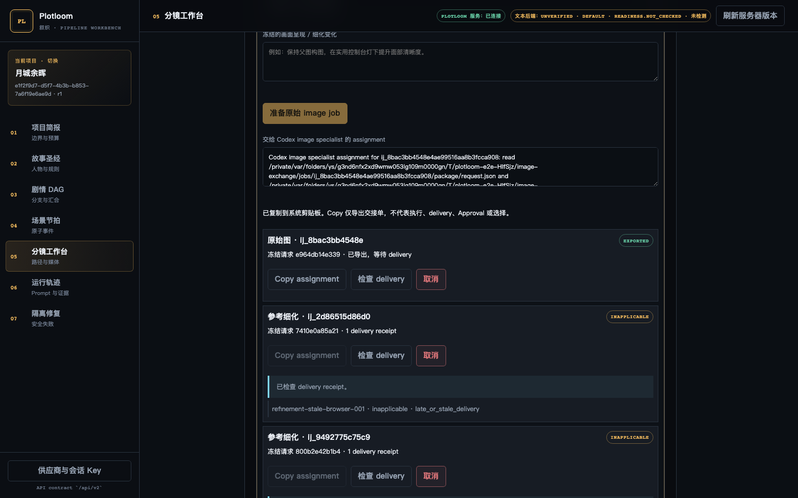

# P1 image-workflow usability — verification receipt

Date: 2026-09-11

Scope: the manual P1 image handoff only. No model, ImageGen, provider, V1, or
automatic-bridge operation was invoked.

## Root causes addressed

- Presentation/refinement text lived only in `ManagedMediaWorkbench` React
  state, so navigation and remount lost it. Session-only, target-scoped drafts
  now retain it and require explicit recovery after Approval/revision/reference
  context changes.
- Refresh used one `delivery_incomplete` failure for both an absent inbox and a
  malformed delivery. An absent/empty inbox now returns `awaiting_delivery`
  without a receipt; any present partial or invalid entry still fails closed.
- The first-project creation path hydrated stage heads but did not load the Gate
  receipt persisted in the same transaction. It now fetches that receipt before
  rendering the first storyboard review.

## Retained-image browser evidence

The 1440×900 FastAPI/file-SQLite Playwright journey used the retained P0 PNG in
`docs/verification/supporting/p0-generated/01-arrival.png`. The test delivery
manifest explicitly identifies it as a retained regression asset; it does not
claim a new image generation.

The route verified first-project Gate visibility, Approval, cross-project,
cross-shot, and original/refinement-target draft isolation, session draft
recovery, clipboard success and manual-copy fallback, awaiting versus
accepted/inapplicable delivery, a browser-submitted tampered manifest rejection,
explicit keyframe selection, selected preview persistence after reload, and
stale-refinement rejection.

## Commands and results

| Check | Result |
| --- | --- |
| `uv run pytest -q tests/backend_core/test_image_jobs.py` | 11 passed |
| `uv run pytest -q` | 543 passed, 9 skipped |
| `npm --prefix frontend test` | 13 files, 122 tests passed |
| `npm --prefix frontend run typecheck` | passed |
| `npm --prefix frontend run typecheck:e2e` | passed |
| `npx playwright test --config playwright.config.ts e2e/image-jobs.spec.ts e2e/first-save.spec.ts` | 5 passed |
| `npx playwright test --config playwright.config.ts` | 25 passed |
| `npm --prefix frontend run build` | passed; regenerated `src/plotloom/static/workbench.js` |
| `uv build --wheel` and `uv run python scripts/smoke_installed_wheel.py dist` | passed |

The full Python and browser suites produced only the repository's existing
deprecation/serializer warnings. A bounded independent review identified the
missing cross-project/tampered-browser coverage and non-verbatim plan copy;
both findings were corrected and the targeted journey rerun. Character identity
references remain an assessment/design follow-up in
[ADR 0029](../adr/0029-manual-image-handoff-usability-and-identity-references.md).

## Source-only acceptance correction

The user explicitly authorized this final, source-only correction after the
prior coordination assignment was superseded. No Flow run or report route was
created or changed for this slice.

- First-save Gate hydration now rechecks the original workspace operation after
  its asynchronous receipt read. A delayed receipt can no longer finish an old
  creation by changing the URL, review, or save state after navigation/newer
  work takes ownership.
- Empty image-direction text now removes only its exact session draft entry.
  The normal, non-stale draft affordance exposes explicit discard; other
  project/shot/refinement entries and stale recovery are unchanged.

Focused regressions passed: `tests/app-state.test.ts` and
`tests/visual-intent-drafts.test.ts` (45 tests), plus
`frontend/e2e/image-jobs.spec.ts` (1 test). The stable correction candidate
passed the full Python suite (543 passed, 9 skipped), frontend unit suite (13
files, 124 tests), frontend and E2E typechecks, full browser suite (25 tests),
frontend build/static regeneration, wheel build, and installed-wheel smoke.
A bounded independent Terra review found no remaining issues in this correction
scope.
