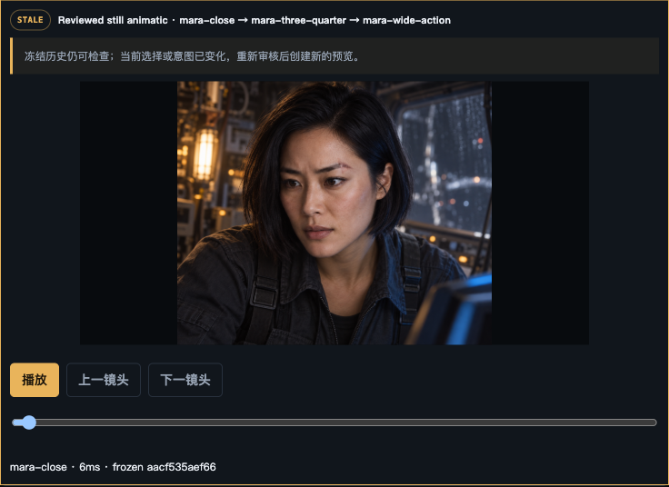

# P1.5 character-reference pilot — bounded visual qualification receipt

Date: 2026-09-12
Scope: one fictional protagonist, three original built-in-ImageGen stills, explicit
creator selection and human review. This is a local development qualification;
it makes no external-provider, video, automatic-dispatch, or production-release
claim.

## Candidate and retained evidence

The implementation candidate is
`c56f7d95ff0b14c27fa2d39ee1c724afeceb3b0f`. The isolated SQLite data,
artifact root, exchange packages, manifests, source images, and browser evidence
are retained outside the disposable worktree at
`/Users/wjmao/projects/HU/plotloom-p15-pilot-FBSu6o`.

The first delivery was produced by the fresh Terra specialist task
`01a09387-7811-7023-8799-2d949e884d28`, whose supplied context was limited to
the repository skill and frozen package. The second and third deliveries used
the same built-in ImageGen route directly from their frozen package references.
Every accepted receipt reports `toolEvidence.tool: "codex_imagegen"`; no API key,
external image API, or video was used.

| Shot | Frozen job / request | Delivered original SHA-256 | Browser outcome |
|---|---|---|---|
| Close facial view | `ij_9d67810dd85c452e9ca3ce11bfb9440b` / `aec5651c89d0d5d4d74e205b144271fa5058cc552ed5c723bf2587b7d40ccf94` | `30a18dc3f9e0f6724ddefd386150b2eebce5d901c4cc549c161fa1e777376e9c` | accepted, explicitly kept, intent r1, reviewed keyframe, same-person pass |
| Three-quarter relay reach | `ij_5131d7ca39714196abb16f700cdae15d` / `908ab03254ef9e2111751b3f21b34ba14cd3554f7946c305a0eb507d7b347f70` | `6c1e575742a7c02b8a6c91883580e2b7048e4dac1076c314c2253041aca55d5f` | accepted, explicitly kept, intent r1, reviewed keyframe, same-person pass |
| Wide relay action | `ij_8251e8f84eae4c54bcc7992e469c3bd2` / `e55e1976d760215788b9a47924fd557818d473c341848777307ea6bad5c6d596` | `d84bf8849d163df2a0bbbf08449131eedc6df405e6eac18b659bd9dd3e7a8364` | accepted, explicitly kept, intent r1, reviewed keyframe, same-person pass |

All three jobs froze the original primary identity reference SHA-256
`b6963057a42b7b79ee352bffae7b794138b9df043b508b6769d4885adf570b36`
and projected its actual bytes as `character_identity:mara-chen`. The browser
accepted the three deliveries only after complete package and manifest checking;
a direct Pydantic recheck of all final receipts also succeeded.

## Human visual comparison

The reviewer inspected the delivered pixels and the reference rather than using
a numerical similarity score. Across the close, three-quarter, and wide action
views, the same oval face, dark eyes, jaw-length dark bob, and visible
left-eyebrow crescent scar remained recognizable. The camera distance and pose
are materially distinct: intimate facial view; side/three-quarter panel work;
and an environmental, braced repair action. The olive work layer, expression,
gloves, lighting, relay action, and composition were assessed as shot state,
not durable identity. No unresolved identity or authored-state contradiction was
recorded for the three r1 reviews.

This is deliberately a human, bounded judgment. It does not claim face
recognition, universal likeness reliability, multi-character qualification, or
motion consistency.

## Preview, stale propagation, and restart

From `mara-close`, the browser selected a contiguous subset of three and created
the reviewed still animatic
`mara-close → mara-three-quarter → mara-wide-action`. The image below is the
persisted preview after its reference dependency was deliberately replaced.

The creator then explicitly replaced Mara's primary reference with the reviewed
close candidate, producing reference revision r2. Plotloom kept the original
reference decision and preview history readable, invalidated all three
identity-aware reviews, and marked that exact three-shot preview `STALE` rather
than silently continuing to call it current. After stopping and restarting the
local service with the same data, artifact, and exchange roots, the browser
still showed r2, three missing current identity-aware reviews, and the same
stale preview. Full-page before/after-restart captures remain in the retained
pilot evidence directory.

## Contract observation and correction

The fresh specialist's first complete receipt initially used raw runtime label
`image_gen.imagegen` for `toolEvidence.tool`. The trusted manifest contract
correctly rejected it as `delivery_manifest_invalid`; the rejected history is
retained in the browser and exchange evidence. The root cause was ambiguous
skill wording, not a permissive validator problem: the public schema requires
the normalized built-in-route label `codex_imagegen`. The specialist skill now
states that exact field value and distinguishes it from the raw runtime tool
identifier. The normalized final receipt was then accepted. The validator was
not weakened, and all three retained final receipts validate against the same
contract.

## Verification and remaining boundary

Focused pilot checks completed:

- delivery manifests for all three jobs validate through
  `ImageDeliveryManifest.model_validate` with `codex_imagegen` evidence;
- browser Prepare → Copy → external delivery → Refresh → Keep → intent →
  reviewed keyframe → manual same-person review completed for every shot;
- the three-shot reviewed still animatic was created, then stale propagation
  survived a service restart;
- the stable implementation candidate previously passed `uv run pytest -q`
  (`548 passed, 9 skipped`), frontend typecheck, unit tests (`124 passed`), and
  production build before this visual qualification.

This receipt qualifies one-character still-image feasibility only. It leaves
video, motion/voice continuity, automatic execution, external providers, and a
live multi-character visual pilot outside the accepted scope.
